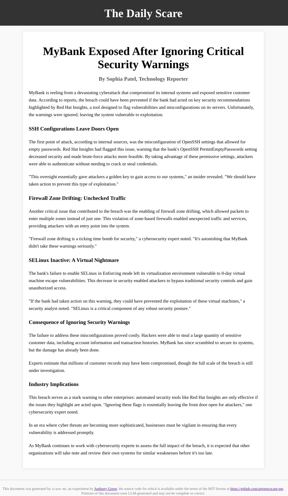

# scare-me
> Transform RHEL Insights reports into tomorrow's headlines!

`scare-me` is a fun tool for generating fake scary news articles based
on your real [RHEL Insights](https://www.redhat.com/en/technologies/management/insights)
reports.  You can customize the article by providing your company name and
industry on the command line:

```
$ insights-client --show-report | scare-me -n "MyBank" -i banking -o news.html -
```

`scare-me` requires a locally-hosted [ollama](https://ollama.com)
instance to be available at `localhost:11434`.  It defaults to using
the [llama3 LLM](https://ollama.com/library/llama3), but you can
change models with the `--model` command line option.

To build `scare-me`, install `ocicl` with homebrew, and run `make`.

`scare-me` is for **entertainment purposes** only!  Here's some sample output:

<p align="center"></p>

Have fun!

AG
